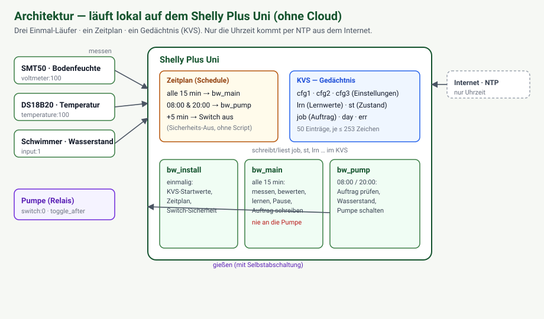

# 1 · Einführung & Architektur — Introduction & architecture

**Sprache / Language:** [Deutsch](#deutsch) · [English](#english) — [Handbuch-Index](README.md)

---

## Deutsch

### Worum geht es?

Dieses Projekt ist eine **selbstlernende, automatische Pflanzenbewässerung** auf Basis eines **Shelly Plus Uni**.
Ein Bodenfeuchtesensor (**Truebner SMT50**), ein Temperaturfühler (**DS18B20**) und ein Schwimmerschalter für den
Wasserstand hängen direkt am Shelly. Drei kleine Scripts laufen **auf dem Gerät selbst** und entscheiden, ob und
wie lange morgens und abends gegossen wird.

Das Besondere:

- **Läuft lokal, ohne Cloud und ohne Server.** Die komplette Logik liegt im Shelly. Nur die Uhrzeit kommt per
  NTP aus dem Internet. Kein Backend, kein Abo, keine App-Pflicht – deine Daten bleiben bei dir.
- **Selbstlernend.** Das Gerät lernt, wie viel Feuchte eine Pumpensekunde bringt, passt die Wassermenge über die
  Temperatur an Sommer und Winter an und beugt Staunässe vor.
- **Ideal für den Urlaub.** Einmal kalibriert, versorgt es deine Pflanzen zuverlässig, während du weg bist –
  mit harten Sicherheitsgrenzen gegen Überwässerung.
- **Programmiert mit KI (Claude Code).** Der gesamte Code entstand mit **Claude Code (Fable 5.1)**. Du kannst das
  Projekt mit denselben Werkzeugen „out of the box" weiterbauen – siehe Kapitel 4–6.

> **Alleinstellungsmerkmal:** Dies ist ein DIY-Smart-Home-Projekt, bei dem die **KI die echte Shelly-Hardware
> direkt live debuggt – und es läuft.** Claude Code kann (über einen Remote-Tunnel, Kapitel 6) den Shelly im
> heimischen Netz auslesen, Scripts hochladen und die Konsole live mitlesen – ferngesteuert von einem Server.

### Wie funktioniert es? (Architektur)

Dauerhaft laufende Scripts stürzen auf dem Shelly nach Stunden ab. Deshalb besteht das System aus **drei
Einmal-Läufern**, die der Zeitplan des Geräts jeweils nur für wenige Sekunden startet. Es gibt **keinen Zustand
im Arbeitsspeicher** – alles steht im **KVS** (Key-Value-Store) des Geräts.



<details><summary>Gleiche Darstellung als Text (ASCII) — same diagram as text</summary>

```
                 ┌─────────────────────────── Shelly Plus Uni ───────────────────────────┐
   SMT50 ───────►│ voltmeter:100                                                          │
   DS18B20 ─────►│ temperature:100      ┌── Zeitplan (Schedule) ──┐                       │
   Schwimmer ───►│ input:1              │ alle 15 min → bw_main    │   KVS (Gedächtnis)    │
   Pumpe ◄───────│ switch:0             │ 08:00 & 20:00 → bw_pump  │   cfg1 cfg2 cfg3      │
                 │                      │ +5 min → Switch aus (Sicherheit)  lrn st job    │
                 │  bw_install (einmal) │                          │   day err            │
                 │  bw_main (messen,    └──────────────────────────┘                       │
                 │           lernen, Auftrag schreiben)                                    │
                 │  bw_pump (gießen im Fenster, Wasserstand überwachen)                    │
                 └────────────────────────────────────────────────────────────────────────┘
```

</details>

- **`bw_install`** – einmal von Hand gestartet: legt die KVS-Startwerte, den Zeitplan und die Switch-Sicherheit an.
- **`bw_main`** – alle 15 Minuten: misst Feuchte/Temperatur/Wasserstand, prüft Plausibilität, bewertet die letzte
  Gabe, lernt, bestimmt die Pause und schreibt einen **Gießauftrag** (`job`) mit Begründung. **Rührt die Pumpe nie an.**
- **`bw_pump`** – in den Gießfenstern (08:00/20:00): liest den Auftrag, prüft alle Freigaben (Wasserstand,
  Tageslimit, Störungen) und schaltet die Pumpe mit einer Selbstabschaltung (`toggle_after`).

Warum diese Trennung? So kann die messende/lernende Logik nie versehentlich die Pumpe auslösen, und jeder Takt
beginnt sauber aus dem KVS. Details und die Gründe dahinter: [`../../README.md`](../../README.md) Abschnitt
„Funktionsweise" und [`../PLAN.md`](../PLAN.md).

### Sicherheit zuerst

Die Pumpe wird **dreifach** abgeschaltet (Selbstabschaltung im Befehl, `auto_off` in der Switch-Konfiguration,
Sicherheits-Aus im Zeitplan) – alle drei wirken **ohne Script**. Eine Gabe ohne messbare Wirkung sperrt das
System, bis ein Mensch nachsieht. Mehr dazu: README-Abschnitt „Sicherheit".

### Weiter geht's

Baue die Hardware auf → [Kapitel 2](02-hardware-verdrahtung.md). Du willst nur den Code verstehen/erweitern →
[Kapitel 4](04-vps-mitentwickeln.md).

---

## English

### What is this?

A **self-learning, automatic plant-watering system** built on a **Shelly Plus Uni**. A soil-moisture sensor
(**Truebner SMT50**), a temperature probe (**DS18B20**) and a float switch for the water level connect directly
to the Shelly. Three small scripts run **on the device itself** and decide whether and how long to water in the
morning and evening.

What makes it special:

- **Runs locally, no cloud, no server.** All logic lives on the Shelly. Only the clock comes from the internet
  via NTP. No backend, no subscription, no mandatory app – your data stays with you.
- **Self-learning.** The device learns how much moisture one pump-second delivers, adapts the amount of water to
  summer/winter via temperature, and prevents waterlogging.
- **Perfect for vacations.** Once calibrated, it reliably keeps your plants alive **while you are away**, with
  hard safety limits against overwatering.
- **Coded with AI (Claude Code).** The entire codebase was written with **Claude Code (Fable 5.1)**. You can keep
  building on it out of the box with the same tools – see chapters 4–6.

> **Unique selling point:** this is a DIY smart-home project where the **AI live-debugs the real Shelly hardware –
> and it works.** Through a remote tunnel (chapter 6) Claude Code can read the Shelly on your home network, upload
> scripts and watch the console live – remote-controlled from a server.

### How it works (architecture)

Long-running scripts crash on the Shelly after a few hours. So the system consists of **three one-shot runners**
that the device's scheduler starts for just a few seconds each. There is **no state in RAM** – everything lives in
the device's **KVS** (key-value store).


- **`bw_install`** – run once by hand: creates the KVS defaults, the schedule and the switch safety config.
- **`bw_main`** – every 15 minutes: measures moisture/temperature/level, checks plausibility, evaluates the last
  watering, learns, determines the pause and writes a **watering job** (`job`) with a reason. **Never touches the pump.**
- **`bw_pump`** – during the watering windows (08:00/20:00): reads the job, checks all clearances (level, daily
  limit, errors) and switches the pump with a self-off timer (`toggle_after`).

Why the split? The measuring/learning logic can never accidentally trigger the pump, and every cycle starts clean
from the KVS. Details and rationale: [`../../README.md`](../../README.md) section "Funktionsweise" and
[`../PLAN.md`](../PLAN.md).

### Safety first

The pump is shut off **three ways** (self-off in the command, `auto_off` in the switch config, safety-off in the
schedule) – all three work **without any script**. A watering with no measurable effect locks the system until a
human checks. More in the README "Sicherheit" section.

### Next

Build the hardware → [chapter 2](02-hardware-verdrahtung.md). Just want to understand/extend the code →
[chapter 4](04-vps-mitentwickeln.md).
